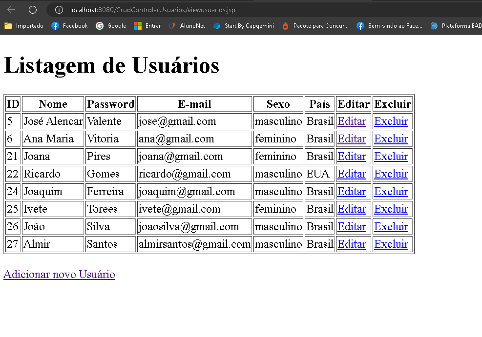

# CrudListarUsuarios

        

# Crud Listar Usuários
 Esta aplicação tem o objetivo de reproduzir as funcionalidades de um CRUD(acrônimo para Create, Read, Update e Delete) para um cadastro de usuários em Java Web JSP;
 
 ## 💻 Sobre o projeto
 Esse projeto foi desenvolvido com o objetivo de desenvolver uma aplicação em Java Web em JSP.
 
 ### 🚧 Recursos Necessários

* jdk 17;
* IDE Eclipse;
* Apache Tomcat 8.5;
* MySQL Workbench 8.0;

## 🛠 Tecnologias Utilizadas

* Java Web JSP;
* Banco de dados da sua preferência;
* Servidor Apache Tomcat;

## 🛠 Orientações Importantes

### IDE e Servidor
* Baixe o Java 17.
* Baixe o Eclipse IDE 2023-03.
* Baixe o Tomcat 8.5.
* Baixe o SQL (Você pode baixar o MySQL Workbench, ou qualquer outro serviço SQL).
* Baixe o repositório da aplicação. 

### Configuração e instalação
* Java - Instalação e configuração das variáveis de ambiente;
* IDE - Instalação da versão do Eclipse IDE for Enterprise Java and Web Developers;
* SQL - Instalação e configuração da porta 3306 como padrão; Uma alternativa de fácil utilização é o Xampp Control v3.3.0;

### Uso da Aplicação
* Baixe e execute o Script SQL;
* No projeto  - "Run on Server" e selecione a versão do servidor Tomcat e por fim clique em "Finish";

## 🚀 Let's code! 